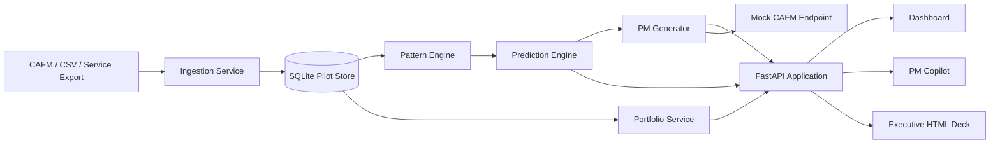
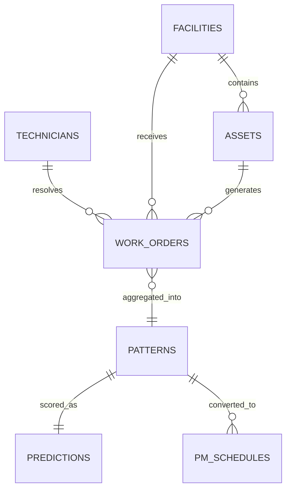

# Architecture

## 1. Architectural Intent

Reactive to PM Intelligence is designed to answer a specific business question: how do we convert reactive work-order history into prioritized, explainable planned maintenance action without forcing a CAFM platform replacement.

The architecture therefore favors:

- fast pilot deployment
- deterministic demo reliability
- clear service separation
- explainable analytics output
- a straightforward production migration path

## 2. System Context

The platform sits between operational work-order history and maintenance execution.

## 3. Architectural Layers

### Experience Layer

- Dashboard UI in `frontend/`
- PM Copilot embedded in the dashboard
- Executive HTML presentation in `presentation/`

### API Layer

- FastAPI routes for ingestion, analytics, PM generation, health, portfolio view, and assistant interaction

### Domain Services Layer

- ingestion service
- pattern engine
- prediction engine
- PM generation service
- portfolio aggregation service
- assistant orchestration service

### Persistence Layer

- SQLite pilot database managed by SQLAlchemy ORM
- persisted model artifact under `ml/model_artifacts/`

### Operations Layer

- startup ingestion
- scheduler bootstrap
- Docker and Kubernetes deployment descriptors

## 4. Runtime Component Responsibilities

### `backend/main.py`

- bootstraps FastAPI
- initializes the database
- ingests sample data on startup when present
- starts and stops the scheduler
- enables CORS for supported frontend origins

### `backend/api/routes.py`

- exposes the full REST surface
- applies bearer token authentication to protected routes
- applies simple per-client rate limiting
- orchestrates pipeline runs and assistant requests

### `backend/services/ingestion_service.py`

- validates incoming work-order structures
- normalizes data shape
- deduplicates on work order identity
- persists work orders

### `backend/services/pattern_engine.py`

- groups work orders by `asset_id`, `location_id`, and `problem_code`
- computes interval statistics
- derives coefficient of variation and Regularity Score
- flags outliers via Isolation Forest
- persists recurring pattern records

### `backend/services/prediction_engine.py`

- converts pattern records into a training frame
- trains a Random Forest classifier
- writes the model artifact to disk
- generates 30, 60, and 90 day recurrence probabilities
- stores lightweight explanation payloads alongside predictions

### `backend/services/pm_generator.py`

- selects patterns above the configured probability threshold
- converts historical interval to PM frequency
- sets next due date at 85 percent of the average interval
- creates PM schedule records suitable for CAFM pushback

### `backend/services/portfolio_service.py`

- materializes facility, asset, and technician reference data
- builds executive-friendly portfolio overview payloads
- surfaces top hotspots and at-risk assets for the UI and assistant

### `backend/services/assistant_service.py`

- builds a portfolio-aware prompt from live intelligence data
- supports `mock`, `gemini`, `mistral`, and `openai`
- returns a reliable deterministic fallback if external calls fail
- anchors the UI around quick actions and targeted operations questions

## 5. Primary Execution Flows

### Analytics Pipeline Flow

1. Work orders exist in the pilot store.
2. The pipeline route truncates derived analytics tables.
3. Reference entities are synchronized.
4. Pattern detection runs on grouped work-order history.
5. Prediction scoring produces recurrence probabilities.
6. PM generation materializes intervention candidates.
7. Dashboard and assistant endpoints consume the fresh intelligence.

### Assistant Flow

1. User selects a quick action or types a targeted question.
2. The frontend sends `action` and `message` to `/api/v1/assistant/chat`.
3. The backend assembles portfolio scale, hotspots, patterns, and predictions.
4. A provider-specific prompt is generated.
5. A live model call is made when configured; otherwise `mock` is used.
6. The response returns message text, provider metadata, and quick action state.

## 6. Data Model Relationships

## 7. Security And Control Posture

Current pilot controls:

- bearer token authentication for protected endpoints
- CORS allow-list
- Pydantic request validation
- SQLAlchemy ORM usage for database access
- in-memory rate limiting per client host
- no PII requirement for analytics or assistant operation

Production controls recommended:

- enterprise identity provider integration
- durable distributed rate limiting
- encrypted secrets management
- audit log enrichment
- PM publication approval workflow
- network policy and service-to-service authentication

## 8. Availability And Scalability Considerations

### Current Pilot Design

- single application runtime
- SQLite for low-friction local execution
- synchronous pipeline execution through API route
- local model artifact persistence

### Production Migration Path

- PostgreSQL for transactional durability and concurrency
- Redis for cache and distributed rate limiting
- worker queue for pipeline execution and scheduled jobs
- object storage or model registry for model artifacts
- container orchestration for horizontal API scaling

## 9. Architectural Trade-Offs

### Why SQLite Now

- fastest possible hackathon and pilot setup
- zero infrastructure dependency for demos
- easy local reset and replay

Trade-off:

- not suitable for multi-user write-heavy enterprise workloads

### Why Heuristic Labels For The Model

- allows a full end-to-end recurrence model before live outcome labels exist

Trade-off:

- model quality is directionally useful but not yet production-calibrated

### Why Static Frontend

- low deployment complexity
- reliable demo behavior
- rapid visual iteration

Trade-off:

- advanced enterprise state management and component reuse are intentionally limited

## 10. Diagram Inventory

Draw.io source files are provided in `docs/diagrams/`:

- `system-architecture.drawio`
- `service-class-diagram.drawio`
- `intelligence-flow.drawio`
- `business-value-flow.drawio`

## 11. Architecture Conclusion

The architecture is intentionally practical: enough engineering rigor to prove operating value, enough modularity to scale, and enough presentation quality to support SLT decisions without requiring a re-platforming story on day one.